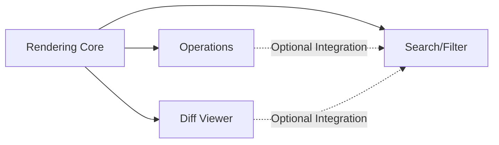

# Tasks Index: Git Graph Visualization

**Feature**: 002-git-graph | **Status**: In Progress | **Created**: 2026-02-24
**Input**: Full-featured git graph visualization with professional version control interface

This parent task file serves as the coordination index for the Git Graph feature implementation. All actual implementation tasks are distributed across child execution lanes.

## Executive Summary

The Git Graph feature implements a comprehensive visual commit history interface modeled after vscode-git-graph. The implementation is divided into 4 parallel execution lanes covering 95 functional requirements across 14 user stories.

### Implementation Stats
- **Total FRs**: 95 (FR-001 to FR-095)
- **User Stories**: 14 (US1-US14)
- **Priority Distribution**:
  - P0: 3 stories (Core visualization)
  - P1: 4 stories (Essential operations)
  - P2: 4 stories (Productivity features)
  - P3: 3 stories (Customization)

## Active Execution Lanes

### 1. **Git Graph Rendering Core** (`specs/021-git-graph-rendering-core/tasks.md`)
- **Scope**: Core visualization, SVG rendering, commit list/detail display
- **User Stories**: US1 (Graph Display), US2 (Commit Details), partial US14 (Feature Highlight)
- **FRs Covered**: FR-001 to FR-022, FR-095
- **Key Components**: GitCommitList.vue, GitCommitRow.vue, GitCommitDetail.vue, useGitGraph.ts
- **Priority**: P0 - Must complete first

### 2. **Git Graph Operations** (`specs/022-git-graph-operations/tasks.md`)
- **Scope**: All git operations (branch, commit, tag, stash, remote)
- **User Stories**: US3-US7, US11
- **FRs Covered**: FR-023 to FR-057, FR-074 to FR-076
- **Key Components**: Context menus, operation dialogs, 30+ new API endpoints
- **Priority**: P1 - Essential workflow operations

### 3. **Git Diff Viewer** (`specs/023-git-graph-diff-viewer/tasks.md`)
- **Scope**: File diff overlay viewer
- **User Stories**: US14 (File Diff Viewer)
- **FRs Covered**: FR-087 to FR-094
- **Key Components**: GitDiffViewer.vue, diff API endpoint
- **Priority**: P0 - Core interaction flow

### 4. **Search, Filter & UX** (`specs/024-git-graph-search-filter-ux/tasks.md`)
- **Scope**: Search widget, branch filters, UI controls, auto-refresh
- **User Stories**: US8, US9, US10, US12, US13
- **FRs Covered**: FR-058 to FR-073, FR-077 to FR-086
- **Key Components**: GitFindWidget.vue, GitBranchFilter.vue, useAutoRefresh.ts
- **Priority**: P2-P3 - Enhancement features

## Execution Strategy

### Phase Dependencies

1. **Rendering Core MUST complete first** - Provides base components all other lanes depend on
2. **Operations, Diff Viewer, Search/Filter can proceed in parallel** after core completion
3. **Integration points are minimal** - Each lane designed for independent development

### Parallel Execution Opportunities

#### Within Each Lane:
- **Rendering Core**: SVG algorithm, virtual scrolling, and detail view can develop in parallel
- **Operations**: Each operation type (branch, commit, tag, stash) can develop in parallel
- **Diff Viewer**: API endpoint and UI component can develop in parallel
- **Search/Filter**: Find widget, branch filter, and auto-refresh can develop in parallel

#### Across Lanes (after core):
- Team of 3-4 developers can work simultaneously on different lanes
- Minimal merge conflicts due to clear file ownership boundaries

### MVP Scope (P0 Stories Only)

For rapid MVP delivery, implement only:
1. **Rendering Core**: Complete lane (US1, US2)
2. **Diff Viewer**: Complete lane (US14)

This provides a read-only git graph with commit exploration - valuable on its own.

### Incremental Delivery Plan

1. **Sprint 1**: Rendering Core (US1, US2) → Deployable read-only graph
2. **Sprint 2**: Diff Viewer (US14) + Branch Operations (US3) → Interactive graph
3. **Sprint 3**: Commit Operations (US4) + Tag Operations (US5) → Full git operations
4. **Sprint 4**: Staging (US6) + Search (US8) → Complete workflow
5. **Sprint 5**: Remaining P2/P3 features → Full parity with vscode-git-graph

## Coordination Rules

1. **Task Creation**: All implementation tasks MUST be created in child lane files, not here
2. **File Ownership**: Each lane has exclusive ownership of specific files (see lane specs)
3. **Shared Files**: Only edited through coordinated PRs with lane owner approval:
   - `types/git.ts` - Extended by multiple lanes
   - `stores/gitGraph.ts` - Partitioned by feature area
   - `server/api/git/log.get.ts` - May need updates for new data
4. **Integration Testing**: After each lane completes, integration test against rendering core
5. **Feature Flags**: Each lane can be feature-flagged for gradual rollout

## Quality Gates

Before marking any lane complete:
1. All FRs for that lane implemented and tested
2. No regressions in existing functionality
3. UI components follow Spec Cat design system (retro-terminal theme)
4. Server endpoints include proper error handling
5. Virtual scrolling performance validated (300+ commits)

## Risk Mitigation

- **Performance Risk**: Virtual scrolling implemented early in rendering core
- **Complexity Risk**: Operations split into small, testable endpoints
- **Integration Risk**: Clear interfaces defined between lanes
- **Scope Risk**: P0 stories form complete MVP, P1-P3 are enhancements

## Success Metrics

- [ ] Graph renders 300 commits in <100ms
- [ ] All 14 user stories independently testable
- [ ] 95 functional requirements fully implemented
- [ ] Auto-refresh maintains <10s currency without UI disruption
- [ ] Keyboard shortcuts work without browser override conflicts

---

**Note**: This is a living document. Update coordination notes as implementation progresses, but keep all executable tasks in the child lane files.
