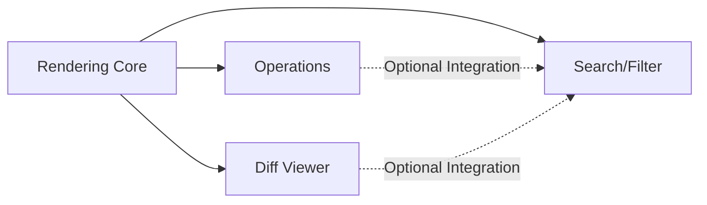

# Implementation Tasks: Git Graph Visualization

**Feature**: 002-git-graph | **Status**: In Progress | **Created**: 2026-02-24
**Input**: Full-featured git graph visualization with professional version control interface

This task file tracks all implementation work for the Git Graph feature. Tasks are organized by execution lane but all FRs are tracked here for traceability.

## Executive Summary

The Git Graph feature implements a comprehensive visual commit history interface modeled after vscode-git-graph. The implementation is divided into 4 parallel execution lanes covering 95 functional requirements across 14 user stories.

### Implementation Stats
- **Total FRs**: 95 (FR-001 to FR-095)
- **User Stories**: 14 (US1-US14)
- **Priority Distribution**:
  - P0: 3 stories (Core visualization)
  - P1: 4 stories (Essential operations)
  - P2: 4 stories (Productivity features)
  - P3: 3 stories (Customization)

## Active Execution Lanes

### 1. **Git Graph Rendering Core** (`specs/021-git-graph-rendering-core/tasks.md`)
- **Scope**: Core visualization, SVG rendering, commit list/detail display
- **User Stories**: US1 (Graph Display), US2 (Commit Details), partial US14 (Feature Highlight)
- **FRs Covered**: FR-001 to FR-022, FR-095
- **Key Components**: GitCommitList.vue, GitCommitRow.vue, GitCommitDetail.vue, useGitGraph.ts
- **Priority**: P0 - Must complete first

### 2. **Git Graph Operations** (`specs/022-git-graph-operations/tasks.md`)
- **Scope**: All git operations (branch, commit, tag, stash, remote)
- **User Stories**: US3-US7, US11
- **FRs Covered**: FR-023 to FR-057, FR-074 to FR-076
- **Key Components**: Context menus, operation dialogs, 30+ new API endpoints
- **Priority**: P1 - Essential workflow operations

### 3. **Git Diff Viewer** (`specs/023-git-graph-diff-viewer/tasks.md`)
- **Scope**: File diff overlay viewer
- **User Stories**: US14 (File Diff Viewer)
- **FRs Covered**: FR-087 to FR-094
- **Key Components**: GitDiffViewer.vue, diff API endpoint
- **Priority**: P0 - Core interaction flow

### 4. **Search, Filter & UX** (`specs/024-git-graph-search-filter-ux/tasks.md`)
- **Scope**: Search widget, branch filters, UI controls, auto-refresh
- **User Stories**: US8, US9, US10, US12, US13
- **FRs Covered**: FR-058 to FR-073, FR-077 to FR-086
- **Key Components**: GitFindWidget.vue, GitBranchFilter.vue, useAutoRefresh.ts
- **Priority**: P2-P3 - Enhancement features

## Execution Strategy

### Phase Dependencies

```mermaid
graph LR
    A[Rendering Core] --> B[Operations]
    A --> C[Diff Viewer]
    A --> D[Search/Filter]
    B -.->|Optional Integration| D
    C -.->|Optional Integration| D
```

1. **Rendering Core MUST complete first** - Provides base components all other lanes depend on
2. **Operations, Diff Viewer, Search/Filter can proceed in parallel** after core completion
3. **Integration points are minimal** - Each lane designed for independent development

### Parallel Execution Opportunities

#### Within Each Lane:
- **Rendering Core**: SVG algorithm, virtual scrolling, and detail view can develop in parallel
- **Operations**: Each operation type (branch, commit, tag, stash) can develop in parallel
- **Diff Viewer**: API endpoint and UI component can develop in parallel
- **Search/Filter**: Find widget, branch filter, and auto-refresh can develop in parallel

#### Across Lanes (after core):
- Team of 3-4 developers can work simultaneously on different lanes
- Minimal merge conflicts due to clear file ownership boundaries

### MVP Scope (P0 Stories Only)

For rapid MVP delivery, implement only:
1. **Rendering Core**: Complete lane (US1, US2)
2. **Diff Viewer**: Complete lane (US14)

This provides a read-only git graph with commit exploration - valuable on its own.

### Incremental Delivery Plan

1. **Sprint 1**: Rendering Core (US1, US2) → Deployable read-only graph
2. **Sprint 2**: Diff Viewer (US14) + Branch Operations (US3) → Interactive graph
3. **Sprint 3**: Commit Operations (US4) + Tag Operations (US5) → Full git operations
4. **Sprint 4**: Staging (US6) + Search (US8) → Complete workflow
5. **Sprint 5**: Remaining P2/P3 features → Full parity with vscode-git-graph

## Coordination Rules

1. **Task Creation**: All implementation tasks MUST be created in child lane files, not here
2. **File Ownership**: Each lane has exclusive ownership of specific files (see lane specs)
3. **Shared Files**: Only edited through coordinated PRs with lane owner approval:
   - `types/git.ts` - Extended by multiple lanes
   - `stores/gitGraph.ts` - Partitioned by feature area
   - `server/api/git/log.get.ts` - May need updates for new data
4. **Integration Testing**: After each lane completes, integration test against rendering core
5. **Feature Flags**: Each lane can be feature-flagged for gradual rollout

## Quality Gates

Before marking any lane complete:
1. All FRs for that lane implemented and tested
2. No regressions in existing functionality
3. UI components follow Spec Cat design system (retro-terminal theme)
4. Server endpoints include proper error handling
5. Virtual scrolling performance validated (300+ commits)

## Risk Mitigation

- **Performance Risk**: Virtual scrolling implemented early in rendering core
- **Complexity Risk**: Operations split into small, testable endpoints
- **Integration Risk**: Clear interfaces defined between lanes
- **Scope Risk**: P0 stories form complete MVP, P1-P3 are enhancements

## Success Metrics

- [ ] Graph renders 300 commits in <100ms
- [ ] All 14 user stories independently testable
- [ ] 95 functional requirements fully implemented
- [ ] Auto-refresh maintains <10s currency without UI disruption
- [ ] Keyboard shortcuts work without browser override conflicts

## Implementation Tasks

### Lane 1: Git Graph Rendering Core

#### Phase 1.1: SVG Graph Foundation
- [ ] T001: Implement SVG-based table layout with Graph column for commit visualization [FR-001]
- [ ] T002: Create SVG path rendering system supporting both rounded (Bezier) and angular (straight) styles [FR-002]
- [ ] T003: Implement deterministic 12-color branch palette with string hashing algorithm [FR-003]
- [ ] T004: Add commit metadata display formatting (7-char hash, 72-char message, author, date) [FR-004]
- [ ] T005: Render commit nodes as circles with visual indicators for regular/merge/HEAD/stash types [FR-005]
- [ ] T006: Display reference labels (branches/tags) as inline badges on commit rows [FR-006]
- [ ] T007: Implement branch label grouping logic for local/remote display [FR-007]
- [ ] T008: Style tag badges to be visually distinct from branch labels [FR-008]
- [ ] T009: Add HEAD position highlighting with cyan/bold styling [FR-009]
- [ ] T010: Display uncommitted changes row with open-circle indicator at top [FR-010]
- [ ] T011: Implement commit muting (50% opacity) for merge commits and non-ancestral commits [FR-011]
- [ ] T012: Ensure High DPI/Retina support for SVG rendering [FR-012]

#### Phase 1.2: Commit Details
- [ ] T013: Create Commit Details View displaying full commit information [FR-013]
- [ ] T014: Implement File Tree/List toggle for changed files display [FR-014]
- [ ] T015: Add color-coded file status badges (A/M/D/R/C) [FR-015]
- [ ] T016: Display file rename information (oldPath → newPath) [FR-016]
- [ ] T017: Show commit statistics (files changed, insertions, deletions) [FR-017]
- [ ] T018: Add keyboard navigation (Up/Down arrows) for commit selection [FR-018]
- [ ] T019: Implement Ctrl/Cmd+Up/Down for parent/child navigation [FR-019]
- [ ] T020: Add inline/docked positioning toggle for detail view [FR-020]
- [ ] T021: Implement two-commit comparison via Ctrl/Cmd+click [FR-021]
- [ ] T022: Support comparing uncommitted changes with any commit [FR-022]
- [ ] T023: Add feature branch highlighting with red-toned background [FR-095]

### Lane 2: Git Graph Operations

#### Phase 2.1: Branch Operations
- [ ] T024: Implement branch checkout operation via context menu [FR-023]
- [ ] T025: Add branch rename functionality with dialog [FR-024]
- [ ] T026: Create branch delete operation with force-delete option [FR-025]
- [ ] T027: Implement merge branch dialog with no-commit, no-ff, squash options [FR-026]
- [ ] T028: Add rebase current branch onto selected branch [FR-027]
- [ ] T029: Create push dialog with force-push and force-with-lease options [FR-028]
- [ ] T030: Implement pull branch with no-ff and squash options [FR-029]
- [ ] T031: Add fetch remote branch with force option [FR-030]
- [ ] T032: Implement create branch from commit with auto-checkout [FR-031]
- [ ] T033: Add copy branch name to clipboard functionality [FR-032]

#### Phase 2.2: Commit Operations
- [ ] T034: Implement checkout commit (detached HEAD) operation [FR-033]
- [ ] T035: Create cherry-pick dialog with record origin and no-commit options [FR-034]
- [ ] T036: Add revert commit functionality [FR-035]
- [ ] T037: Implement merge commit operation with options [FR-036]
- [ ] T038: Create reset dialog with Soft/Mixed/Hard modes [FR-037]
- [ ] T039: Add copy commit hash to clipboard [FR-038]
- [ ] T040: Implement copy commit subject to clipboard [FR-039]

#### Phase 2.3: Tag Operations
- [ ] T041: Create tag dialog supporting annotated and lightweight tags [FR-040]
- [ ] T042: Implement tag delete with optional remote deletion [FR-041]
- [ ] T043: Add push tag to remote functionality [FR-042]
- [ ] T044: Create annotated tag details viewer [FR-043]
- [ ] T045: Add copy tag name to clipboard [FR-044]

#### Phase 2.4: Stash Operations
- [ ] T046: Display stash entries with distinct visual indicator [FR-045]
- [ ] T047: Implement apply stash with reinstate-index option [FR-046]
- [ ] T048: Add pop stash with reinstate-index option [FR-047]
- [ ] T049: Create drop stash functionality [FR-048]
- [ ] T050: Implement create branch from stash [FR-049]
- [ ] T051: Add stash uncommitted changes dialog with include-untracked [FR-050]
- [ ] T052: Implement copy stash name and hash to clipboard [FR-051]

#### Phase 2.5: Staging & Commit
- [ ] T053: Display staged/unstaged files in separate sections [FR-052]
- [ ] T054: Implement individual file stage/unstage operations [FR-053]
- [ ] T055: Add stage-all and unstage-all functionality [FR-054]
- [ ] T056: Create commit dialog with Ctrl/Cmd+Enter shortcut [FR-055]
- [ ] T057: Implement file rename detection in status display [FR-056]
- [ ] T058: Add uncommitted changes context menu (Stash, Reset, Clean) [FR-057]

#### Phase 2.6: Remote Management
- [ ] T059: Create remote list viewer with URLs display [FR-074]
- [ ] T060: Implement fetch all remotes with prune options [FR-075]
- [ ] T061: Add remote management (add/edit/delete) dialogs [FR-076]

### Lane 3: Git Diff Viewer

#### Phase 3.1: Diff Viewer Core
- [ ] T062: Open unified diff viewer when file clicked in commit details [FR-087]
- [ ] T063: Render diff viewer as overlay covering right panels [FR-088]
- [ ] T064: Display unified diff with line numbers and syntax highlighting [FR-089]
- [ ] T065: Create diff viewer header with file info and close button [FR-090]
- [ ] T066: Implement close via button or Escape key [FR-091]
- [ ] T067: Support switching files without closing diff viewer [FR-092]
- [ ] T068: Display binary file indicator for non-text files [FR-093]
- [ ] T069: Create server API endpoint for fetching file diffs [FR-094]

### Lane 4: Search, Filter & UX

#### Phase 4.1: Search & Filter
- [ ] T070: Create Find Widget (Ctrl/Cmd+F) for multi-field search [FR-058]
- [ ] T071: Implement search result highlighting and navigation [FR-059]
- [ ] T072: Create branch filter dropdown with multi-select and glob patterns [FR-060]
- [ ] T073: Add 300ms search debouncing [FR-061]
- [ ] T074: Implement search results caching (max 10 entries) [FR-062]

#### Phase 4.2: Auto-refresh & Performance
- [ ] T075: Create repository state polling endpoint (10-second interval) [FR-063]
- [ ] T076: Preserve UI state during auto-refresh [FR-064]
- [ ] T077: Defer refresh during active user interaction [FR-065]
- [ ] T078: Skip UI redraw when no state changes detected [FR-066]
- [ ] T079: Implement progressive loading (300 initial, 100 incremental) [FR-067]
- [ ] T080: Add virtual scrolling for commit list [FR-068]
- [ ] T081: Display last updated indicator with relative time [FR-069]

#### Phase 4.3: Toolbar & UI Controls
- [ ] T082: Create toolbar with branch filter, find, settings, fetch, refresh buttons [FR-070]
- [ ] T083: Implement column visibility toggles for Date, Author, Commit [FR-071]
- [ ] T084: Add column resizing via drag handles [FR-072]
- [ ] T085: Implement reference label alignment options [FR-073]

#### Phase 4.4: Keyboard Shortcuts
- [ ] T086: Add Find button in toolbar (no Ctrl+F override) [FR-077]
- [ ] T087: Implement Ctrl/Cmd+H to scroll to HEAD [FR-078]
- [ ] T088: Add Refresh button in toolbar (no Ctrl+R override) [FR-079]
- [ ] T089: Implement Ctrl/Cmd+S to scroll to stashes [FR-080]
- [ ] T090: Add Escape key handling cascade (dialogs → menus → views) [FR-081]
- [ ] T091: Implement Enter key to submit active dialog [FR-082]

#### Phase 4.5: Commit Message Enhancement
- [ ] T092: Render HTTP/HTTPS URLs as clickable links [FR-083]
- [ ] T093: Support gitmoji shortcode rendering (:bug: → 🐛) [FR-084]
- [ ] T094: Add Markdown formatting support (bold, italic, code) [FR-085]
- [ ] T095: Display GPG signature status badges on commits [FR-086]

## Task Dependencies

- Lane 1 must complete before Lanes 2, 3, and 4 can begin
- T001-T012 (SVG foundation) blocks all other rendering tasks
- T013-T023 (commit details) can proceed after T001-T012
- T024-T061 (operations) require T001-T023 complete
- T062-T069 (diff viewer) require T013-T023 complete
- T070-T095 (search/UX) can proceed after T001-T023

## Success Metrics

- [ ] All 95 functional requirements implemented and tested
- [ ] Graph renders 300 commits in <100ms
- [ ] All 14 user stories independently testable
- [ ] Auto-refresh maintains <10s currency without UI disruption
- [ ] Keyboard shortcuts work without browser override conflicts
